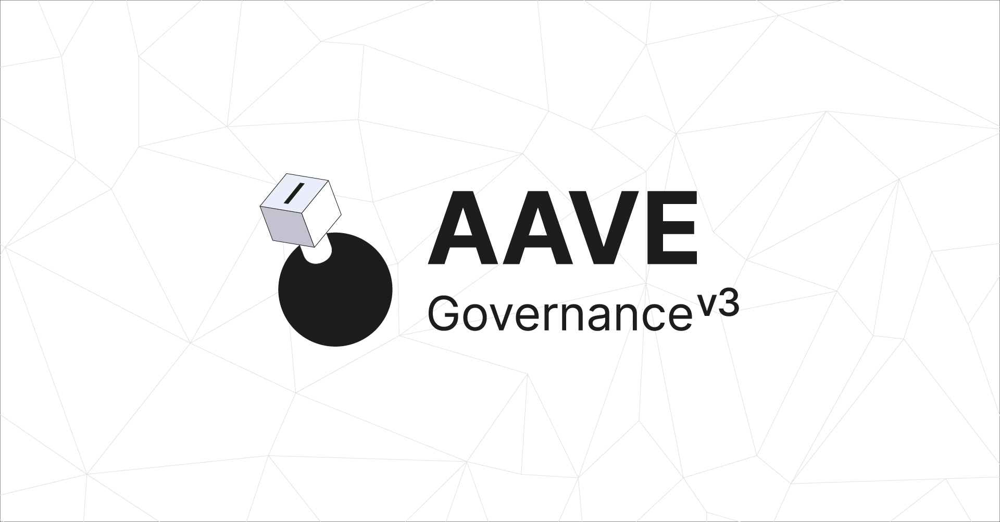

# Aave Governance V3 frontend



React application to interact with the Aave Governance V3 smart contracts. Built for the Aave DAO — originally developed by [BGD Labs](https://bgdlabs.com), now maintained by [Aave Labs](https://aave.com).

## Setup

Requires [Node.js](https://nodejs.org/) 18+ and [Yarn](https://yarnpkg.com/).

```sh
yarn && yarn dev
```

Or for a production build:

```sh
yarn && yarn build && yarn start
```

## Configuration

Environment variables are documented in [.env.example](./.env.example).

| Variable | Description | Default |
|---|---|---|
| `WC_PROJECT_ID` | [WalletConnect](https://docs.walletconnect.com/2.0/cloud/relay) project ID | Built-in fallback |
| `NEXT_PUBLIC_DEPLOY_FOR_IPFS` | Enable static export for IPFS deployment | `false` |
| `NEXT_PUBLIC_CACHE_URL` | Governance cache base URL | GitHub raw cache |
| `NEXT_PUBLIC_RPC_*` | Custom RPC URLs per chain (e.g. `NEXT_PUBLIC_RPC_MAINNET`) | Public RPCs |

Setting your own RPC URLs (e.g. via [Alchemy](https://www.alchemy.com/) or [Infura](https://www.infura.io/)) is recommended for production use.

RPC URLs can also be changed directly in [`src/utils/chains.ts`](./src/utils/chains.ts) and IPFS gateway URLs in [`src/utils/configs.ts`](./src/utils/configs.ts).

## Deployment

### Vercel

[](https://vercel.com/new/clone?repository-url=https%3A%2F%2Fgithub.com%2Faave-dao%2Faave-governance-interface&env=WC_PROJECT_ID&envDescription=Environment%20variables%20needed%20to%20run%20the%20app&envLink=https%3A%2F%2Fgithub.com%2Faave-dao%2Faave-governance-interface%2Fblob%2Fmain%2F.env.example)

### IPFS

1. Set the environment variable:
   ```sh
   export NEXT_PUBLIC_DEPLOY_FOR_IPFS=true
   ```
2. Build the static export:
   ```sh
   yarn && yarn build
   ```
   This produces a fully static site in the `./out` directory.
3. Pin the `./out` directory to IPFS using a pinning service such as [Pinata](https://www.pinata.cloud/) or [Infura](https://www.infura.io/).

A GitHub Actions workflow is also available at [`.github/workflows/ipfs_deploy.yml`](./.github/workflows/ipfs_deploy.yml) for automated IPFS deployments via Pinata. It can be triggered manually from the Actions tab and requires `PINATA_API_KEY` and `PINATA_SECRET_KEY` secrets configured in the repository.

## Governance cache

The app relies on a governance cache to avoid fetching all proposal data directly from the blockchain. The cache provides pre-indexed proposal details, vote data, events, and IPFS metadata as static JSON files served from GitHub.

To set up your own cache:

1. Fork [aave-governance-cache](https://github.com/aave-dao/aave-governance-cache).
2. Follow the setup and deployment guides in the forked repository.
3. Point the app to your fork by setting `NEXT_PUBLIC_CACHE_URL`:
   ```
   NEXT_PUBLIC_CACHE_URL=https://raw.githubusercontent.com/<your-org>/aave-governance-cache/main/cache
   ```

## Built with

[React](https://react.dev/) | [Next.js](https://nextjs.org/) | [zustand](https://docs.pmnd.rs/zustand/getting-started/introduction) | [viem](https://viem.sh/) | [wagmi](https://wagmi.sh/) | [MUI system](https://mui.com/system/getting-started/) | [Headless UI](https://headlessui.com/)

## License

This project is licensed under the [MIT License](./LICENSE). Copyright (c) 2026 Aave DAO.
